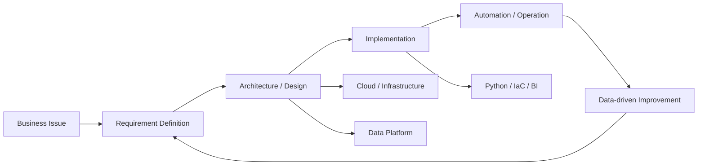
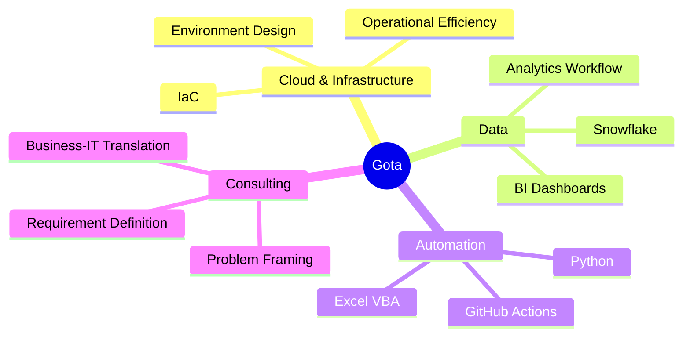

# Gota | Consultant × Engineer

 

外資系ITコンサルティング企業で、コンサルタント兼エンジニアとして活動しています。  
ビジネス課題を構造化し、クラウド・データ・自動化を使って実装まで落とし込むことに強みがあります。

 

---

## What I Do

| Area | Value I Provide |
| --- | --- |
| **Consulting** | 課題整理、要件定義、ステークホルダー調整、改善施策の具体化 |
| **Engineering** | インフラ構築、データ活用基盤、Pythonによる自動化、GitHub Actions活用 |
| **Data & BI** | Snowflake、Power BI、Excel VBAなどを用いた分析・可視化・業務改善 |
| **Delivery** | 設計から実装、運用改善までをつなぐハンズオンな推進 |

## Tech Stack

### Core

  
  
  
  
  

### Engineering Workflow

  
  
  
  
  

## Engineering Themes

## Current Focus

- クラウド・インフラ領域の設計力と実装力の強化
- データ分析基盤とBIによる意思決定支援
- Python / VBA / GitHub Actionsを使った業務自動化
- コンサルティングワークとエンジニアリングの接続

## GitHub Activity

 

## Working Style

> Think structurally. Build practically. Improve continuously.

| Principle | How I Work |
| --- | --- |
| **Structure first** | 課題・制約・目的を分解してから設計する |
| **Hands-on delivery** | 資料だけで終わらせず、動くものまで持っていく |
| **Automation mindset** | 繰り返し作業を仕組み化し、再現性を高める |
| **Business impact** | 技術選定を目的化せず、成果につながる実装を重視する |

---

### Let's build systems that make work simpler, faster, and smarter.

